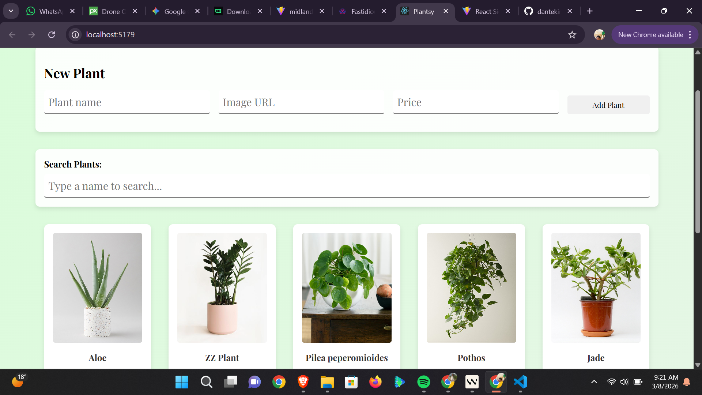

# React Hooks Plant Shop

A modern React application for managing a plant shop, built with Vite and styled with CSS. This app allows users to view plants, add new plants, mark plants as sold out, and search for plants by name.

## Features

- **View All Plants**: Displays a list of plants fetched from the backend on page load.
- **Add New Plants**: Submit a form to add new plants to the shop, which persists to the backend.
- **Mark as Sold Out**: Toggle the stock status of individual plants.
- **Search Plants**: Filter plants by name in real-time.
- **Responsive Design**: Beautiful, modern UI with hover effects and responsive layout.

## Screenshot



## Installation

1. Clone the repository:
   ```bash
   git clone https://github.com/dantekin79-creator/react-hooks-plantshop-cr-vite.git
   cd react-hooks-plantshop-cr-vite
   ```

2. Install dependencies:
   ```bash
   npm install
   ```

3. Start the backend server:
   ```bash
   npm run server
   ```

4. In a new terminal, start the development server:
   ```bash
   npm run dev
   ```

5. Open [http://localhost:5173](http://localhost:5173) in your browser.

## Usage

- **Viewing Plants**: Plants load automatically on page load.
- **Adding Plants**: Fill out the form with name, image URL, and price, then submit.
- **Sold Out**: Click the button on a plant card to toggle between "In Stock" and "Out of Stock".
- **Searching**: Type in the search bar to filter plants by name.

## API Endpoints

- `GET /plants`: Fetch all plants.
- `POST /plants`: Add a new plant (requires name, image, price).

Backend runs on `http://localhost:6001`.

## Technologies Used

- React 18
- Vite
- JSON Server (for backend)
- CSS for styling
- Vitest for testing

## Contributing

1. Fork the repository.
2. Create a feature branch (`git checkout -b feature/new-feature`).
3. Commit your changes (`git commit -am 'Add new feature'`).
4. Push to the branch (`git push origin feature/new-feature`).
5. Open a Pull Request.

## License

This project is open source and available under the [MIT License](LICENSE).

## Support

If you have any questions or issues, please open an issue on GitHub.
